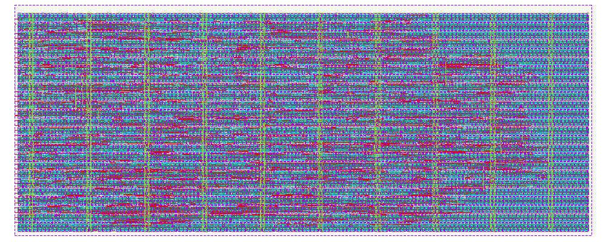

# Heichips 2026 Hackathon - DNA Sequence Aligner

This is a hardware-accelerator for DNA sequence alignment based on the Smith-Waterman algorithm

:metal: The original README.md file is [here](./README_original.md)

## Architecture


The design is divided into two parts.
1. DNA alignment accelerator  : Implemented in the *ASIC* ([accelerator.sv](macros/heichips26_dna_sequencer/rtl/accelerator/accelerator.sv))
2. RISC-V core                : Implemented in the *eFPGA* ([fpga_top.sv](macros/heichips26_dna_sequencer/rtl/riscv_core/fpga_top.sv))

- (Optional) uart_controller : Implemented in the *eFPGA* ([fpga_top_module.sv](macros/heichips26_dna_sequencer/rtl/uart_controller/fpga_top_module.sv))
  - This is designed to directly drive the accelerator using a PC instead of connecting to the RISC-V core.

### **DNA Alignment Accelerator**
  - Performs the Smith-Waterman algorithm in hardware
  - This is capable of running at 130MHz with ihp-sg13cmos5l PDK
  - Computes the dynamic programming matrix in parallel using a  systolic array
  - Supports 8-character long DNA sequences.
  - Fully pipelined and capable of receiving a new test sequence while  previous sequence is still being processed.

  

### **RISC-V (Task Specialized) Processor**
  - A tiny RV32I task specific core runs at 15MHz implemented in the eFPGA.
  - 6-stage multi-cycle core.
  - Supports a subset of RV32I instructions.
    - LW, SW, ADDI, ANDI, AND, OR, BEQ, JAL
  - Drives the accelerator.
  - Feeds sequences from the on-chip memory to the accelerator
  - Stores the alignment results back into memory

#### eFPGA Resource Utilization

| Resource | Used | Available | Utilisation |
|---|---:|---:|---:|
| FABULOUS_LC | 246 | 288 | 85% |
| IOBUF | 20 | 32 | 62% |
| TT_PROJECT | 0 | 11 | 0% |
| TT_PROJECT_LARGE | 0 | 2 | 0% |
| TT_PROJECT_MUX | 0 | 1 | 0% |
| IHP_SRAM_1024x32_1RW | 1 | 1 | 100% |
| GBUF | 1 | 4 | 25% |
| SYS_RESET | 0 | 1 | 0% |

## How It Works

1. The RISC-V processor (in eFPGA) loads the encoded DNA sequences from the on-chip memory.
2. The sequences are written to the accelerator through its MMIO interface.
3. The systolic array performs the alignment computation.
4. The processor polls the accelerator status until the result is ready.
5. The alignment score is read from the accelerator.
6. The result is stored back into on-chip memory.

## Testing

- **SystemVerilog testbench**: [accelerator_tb.sv](macros/heichips26_dna_sequencer/testbenches/verilog/accelerator_tb.sv)
- **Cocotb testbench**: [heichips26_dna_sequencer_tb.py](macros/heichips26_dna_sequencer/testbenches/cocotb/heichips26_dna_sequencer_tb.py)

```
nix-shell
export PDK_ROOT=$(pwd)/IHP-Open-PDK && export PDK=ihp-sg13cmos5l
cd macros/heichips26_dna_sequencer/
make sim-rtl-verilog CELL=heichips26_dna_sequencer
make sim-rtl-cocotb CELL=heichips26_dna_sequencer
make sim-gl-cocotb CELL=heichips26_dna_sequencer
```

## Hardware Requirements

- We would like to have an UART interface in the SOC to connect the accelerator directly to a PC (skipping the RISC-V processor in the eFPGA).


## License

The code in this repository is licensed under Apache 2.0 WITH SHL-2.1 if not otherwise stated.
